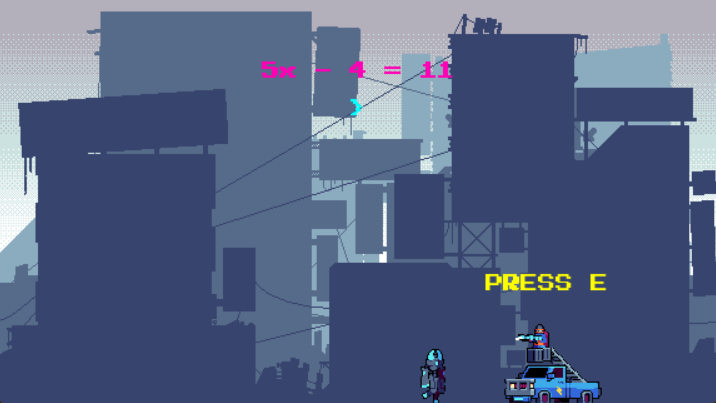

CYBER: Linear Protocol

> Author: Wajiha Tasaduq

> License: See ASSETS_LICENSES.txt for asset licenses

## Overview
CYBER: Linear Protocol is a 2D cyber-themed educational game built in Python using Pygame.
Players control a robot character, solve math puzzles, and interact with NPCs to progress through levels.
The game features smooth animated backgrounds, preloaded characters, and terminal-style question prompts.

## Features
- 7 Levels of cyber-themed challenges
- Terminal-style puzzles with typing input for answers
- Animated characters and NPCs
- Preloaded backgrounds and characters for smooth gameplay
- Repeated backgrounds for levels 5–7 to reduce memory usage
- Keyboard Controls:
- LEFT / RIGHT to move
- E to interact with NPC
- ENTER to submit answers
- BACKSPACE to edit input
- End screen with congratulatory animation

## Controls
- Action	Key
- Move Left	LEFT ARROW
- Move Right	RIGHT ARROW
- Interact / Ask Question	E
- Submit Answer	ENTER
- Delete Character	BACKSPACE
- Assets: All characters and backgrounds were sourced from Craftpix.net.
- License details: Craftpix Asset License. See ASSETS_LICENSES.txt for full asset attribution.

## Installation
Make sure you have Python 3.x installed.
- Install dependencies:
pip install pygame
- Clone or download this repository:
git clone https://github.com/codeWace/cyber_linear_protocol.git

## Run the game:
- python main.py

## Credits
- Game and code by Wajiha Tasaduq
- Assets by Craftpix.net (characters & backgrounds)
- Font: Press Start 2P by The Press Start 2P Project Authors (CodeMan38)
  Licensed under the SIL Open Font License 1.1
  License file included as `assets/fonts/OFL.txt`

## Screenshots

## Notes
- Levels 5–7 reuse backgrounds from earlier levels to optimize performance.
- All sprites and backgrounds are preloaded for smoother gameplay.
- Clicking the window during gameplay will not freeze the game.
